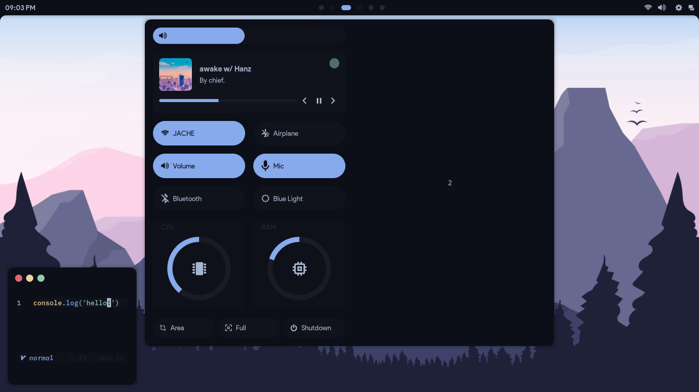

# Experimental Dots

This repo aims to contain just my dotfiles, usually, in this repo just will
exists the WIP setups that i'm making and my others files inside .config and .local/bin.

This repo aims to be just a backup, don't steal everything if you don't know at all what
are you doing, else, do it idk.

> The current WIP setup is using AwesomeWM, it's not done, but when it gets done, i'll publish
them in the right [dotfiles](https://github.com/AlphaTechnolog/dotfiles).
